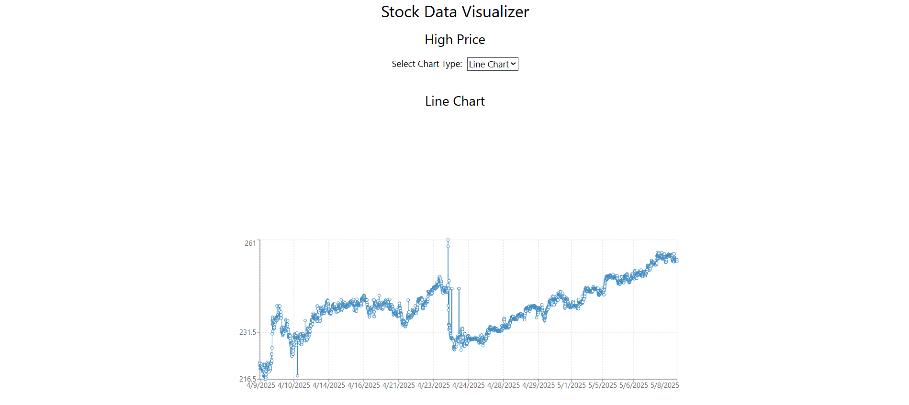

# Stock Data Visualizer

Visualize stock data from the Alpha Vantage API using interactive charts.

## Charts

- **Line Chart:** Shows the trend of the adjusted closing price over time.
- **Bar Chart:** Displays the daily trading volume.

## Setup

1.  Ensure Node.js and npm are installed.
2.  Create a react app using vite.
3.  Install the required libraries and modules like tailwind css, recharts, any other if required.
4.  Get a free API key from [Alpha Vantage](https://www.alphavantage.co/support/#api-key).
5.  Copy the code from `src/App.jsx` of this repository to `src/App.jsx` or `src/App.tsx` of your react app folder.
6.  Update the `apiKey` variable in `src/App.jsx`.
7.  Start the app with `npm run dev`.

## Usage

Open the provided local development URL in your browser and use the dropdown to switch between chart types.

## License

[MIT License](LICENSE)

## Credits

- Data: [Alpha Vantage](https://www.alphavantage.co/)
- UI: [React](https://react.dev/), [Tailwind CSS](https://tailwindcss.com/)
- Build: [Vite](https://vitejs.dev/)
- Charts: [Recharts](https://recharts.org/)

## Output of the code you may get

